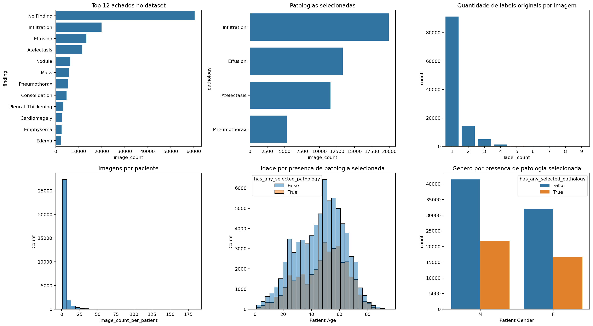
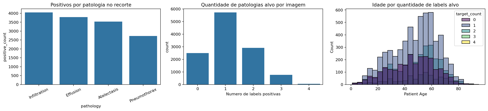
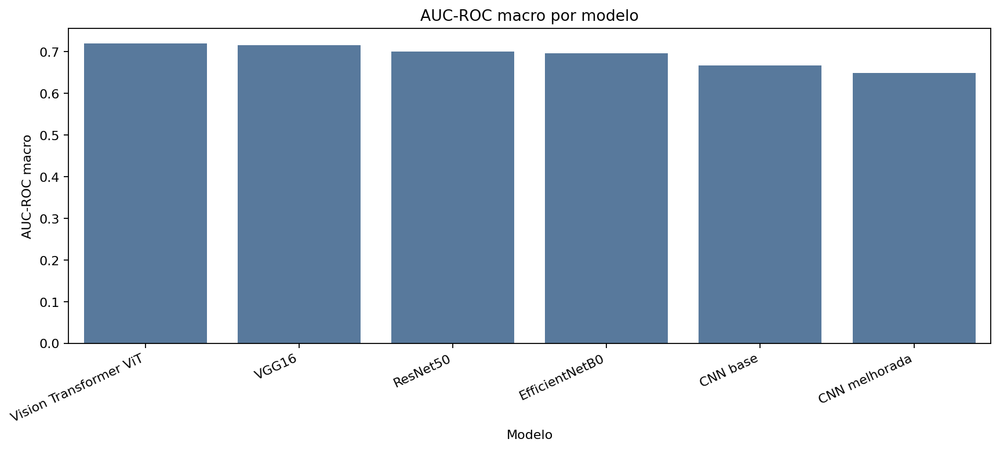
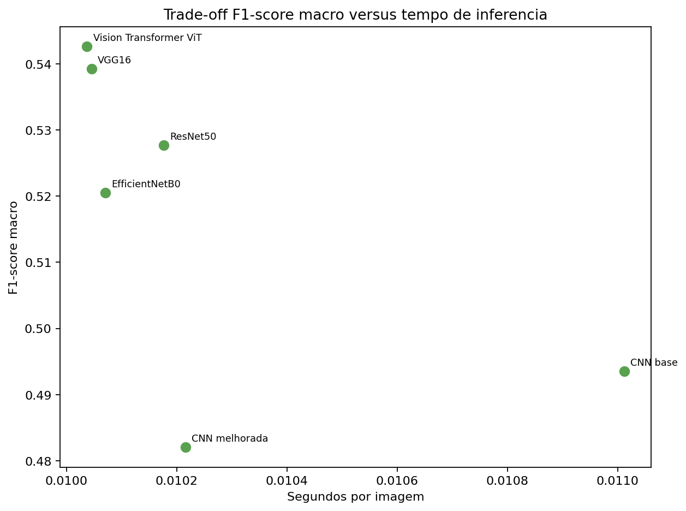
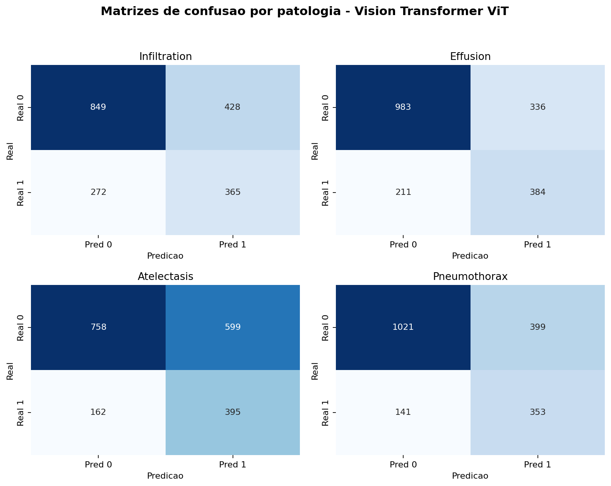
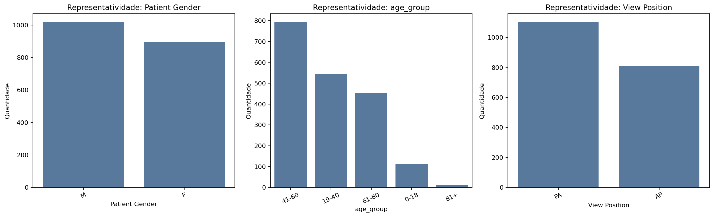
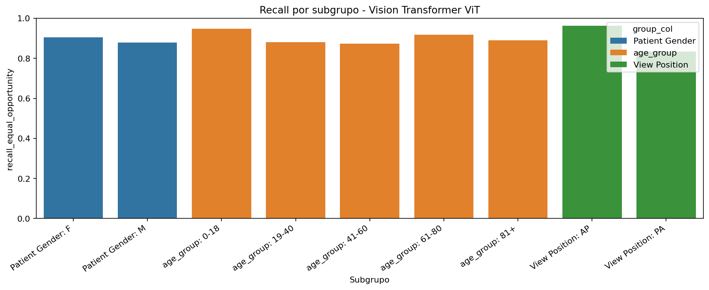
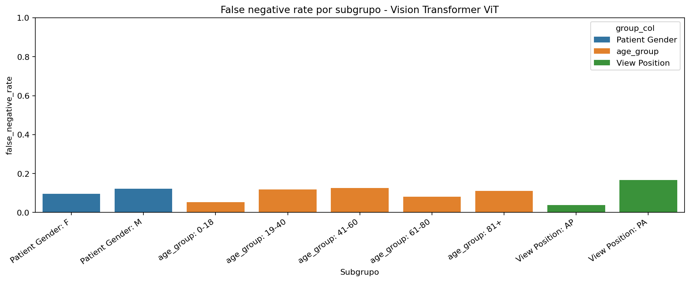

# CardioIA Vision - PBL Fase 4

Projeto academico de Visao Computacional para apoio a triagem de achados em radiografias de torax. A solucao usa o dataset publico NIH Chest X-rays, treina modelos em PyTorch, compara CNNs, transfer learning e Vision Transformer, executa analise de fairness e entrega uma interface integrada com backend Flask e app React Native/Expo.

> Este projeto e uma prova de conceito academica. Ele nao substitui avaliacao medica, nao deve ser usado como ferramenta diagnostica real e depende de validacao clinica externa antes de qualquer aplicacao fora do contexto educacional.

## 1. Resumo executivo

O desafio foi tratado como classificacao **multi-label** de quatro patologias:

- `Infiltration`
- `Effusion`
- `Atelectasis`
- `Pneumothorax`

Foi escolhida uma abordagem multi-label porque uma mesma radiografia pode conter mais de um achado simultaneamente. Assim, o modelo retorna quatro probabilidades independentes em vez de forcar uma unica classe final.

O modelo final selecionado foi o **Vision Transformer ViT-B/16**, escolhido por ranking ponderado com F1 macro, recall macro, AUC-ROC macro e tempo medio de inferencia.

| Metrica do modelo final | Valor |
|---|---:|
| F1 macro | 0,5426 |
| Recall macro | 0,6605 |
| AUC-ROC macro | 0,7201 |
| PR-AUC macro | 0,5323 |
| Precision macro | 0,4651 |
| Hamming loss | 0,3328 |
| Acuracia exata multi-label | 0,2116 |
| Tempo medio de inferencia | 0,0100 s/imagem |

## 2. Arquitetura da solucao

```text
Dataset NIH Chest X-rays
        |
        v
Notebook PyTorch
EDA -> pre-processamento -> split por paciente -> treino -> avaliacao -> fairness
        |
        v
Artefatos
metricas CSV + figuras PNG + splits + checkpoint local
        |
        v
Backend Flask
/health + /metrics + /predict
        |
        v
App React Native/Expo
upload de imagem + probabilidades por patologia + resumo das metricas
        |
        v
Docker Compose
backend + mobile web em containers
```

## 3. Estrutura do projeto

```text
.
├── README.md
├── docker-compose.yml
├── backend/
│   ├── app.py
│   ├── Dockerfile
│   └── requirements.txt
├── mobile-app/
│   ├── App.js
│   ├── Dockerfile
│   ├── app.json
│   ├── babel.config.js
│   ├── package.json
│   └── package-lock.json
├── Docs/
│   └── relatorio_tecnico_fase4.md
└── notebooks/
    ├── CardioIA_Vision_PBL_Fase4.ipynb
    └── artifacts_cardioia_pytorch_multilabel/
        ├── comparativo_modelos.csv
        ├── fairness_discussao.md
        ├── fairness_por_grupo.csv
        ├── justificativa_modelo_final.txt
        ├── train_split.csv
        ├── val_split.csv
        ├── test_split.csv
        ├── tabelas/
        └── figuras/
```

## 4. Explicacao arquivo a arquivo

### Raiz do projeto

| Arquivo | Funcao |
|---|---|
| `README.md` | Documentacao principal do projeto. Explica arquitetura, pastas, artefatos, execucao Docker, backend, mobile app, resultados e limitacoes. |
| `docker-compose.yml` | Orquestra os containers `backend` e `mobile`. Expoe o Flask na porta `5000` e o app web Expo na porta `8081`. Monta os artefatos do notebook como volume read-only no backend. |
| `.gitignore` | Evita versionar ambientes locais, caches, logs, `node_modules`, `.venv`, arquivos temporarios e checkpoints `.pt` grandes. |
| `.dockerignore` | Reduz o contexto de build do Docker, ignorando caches, ambientes virtuais, node_modules, artefatos grandes e arquivos temporarios. |

### Pasta `backend/`

| Arquivo | Funcao |
|---|---|
| `backend/app.py` | API Flask de inferencia. Reconstrui o `vit_b_16`, carrega o `vision_transformer_vit.pt`, aplica pre-processamento e retorna probabilidades multi-label. |
| `backend/Dockerfile` | Imagem Docker do backend. Usa Python 3.11 slim, instala Flask, Pandas, Pillow, PyTorch CPU e Torchvision. |
| `backend/requirements.txt` | Dependencias Python para execucao fora do Docker. Inclui Flask, CORS, Pandas, Pillow, Torch e Torchvision. |

Endpoints do backend:

| Metodo | Rota | Descricao |
|---|---|---|
| `GET` | `/health` | Retorna status do backend, device usado, labels, threshold e existencia do checkpoint. |
| `GET` | `/metrics` | Retorna metricas do modelo final e metricas por classe a partir dos CSVs gerados pelo notebook. |
| `POST` | `/predict` | Recebe uma imagem no campo multipart `image`, executa o modelo e retorna probabilidades por patologia. |

Fluxo interno do `/predict`:

1. recebe a imagem enviada pelo app;
2. salva temporariamente;
3. abre com Pillow e converte para RGB;
4. redimensiona para `224x224`;
5. normaliza com media/desvio ImageNet;
6. executa o Vision Transformer;
7. aplica `sigmoid` nos logits;
8. compara cada probabilidade com threshold `0.5`;
9. retorna JSON com probabilidades, labels detectadas e aviso academico.

### Pasta `mobile-app/`

| Arquivo | Funcao |
|---|---|
| `mobile-app/App.js` | Interface React Native/Expo. Permite configurar URL do backend, selecionar imagem, enviar para `/predict`, exibir probabilidades e mostrar metricas resumidas. |
| `mobile-app/Dockerfile` | Imagem Docker do app. Usa Node 20, instala dependencias via `npm ci` e sobe Expo em modo web. |
| `mobile-app/app.json` | Configuracao do Expo: nome, slug, orientacao, tema e metadados basicos do app. |
| `mobile-app/babel.config.js` | Configuracao Babel usada pelo Expo/React Native. |
| `mobile-app/package.json` | Scripts e dependencias do app. Define `start`, `start:offline`, `start:docker`, `web`, `android` e `ios`. |
| `mobile-app/package-lock.json` | Lockfile do npm. Garante instalacao reprodutivel das dependencias do app. |

Scripts relevantes:

| Script | Uso |
|---|---|
| `npm run start:docker` | Usado dentro do Docker. Sobe `expo start --web --port 8081`. |
| `npm run start:offline` | Uso local no Windows. Sobe Expo offline na porta `8081`, evitando chamadas externas durante apresentacao. |
| `npm run web` | Sobe Expo em modo web fora do Docker. |
| `npm run android` | Abre fluxo Android quando o ambiente local tem suporte. |
| `npm run ios` | Abre fluxo iOS quando o ambiente local tem suporte. |

### Pasta `Docs/`

| Arquivo | Funcao |
|---|---|
| `Docs/relatorio_tecnico_fase4.md` | Relatorio curto da entrega. Resume objetivo, dataset, pre-processamento, modelos, resultados, fairness, prototipo, limitacoes e conclusao. |

### Pasta `notebooks/`

| Arquivo | Funcao |
|---|---|
| `notebooks/CardioIA_Vision_PBL_Fase4.ipynb` | Notebook principal. Contem o fluxo completo: setup, download/organizacao, EDA, pre-processamento, DataLoaders, treino, avaliacao, comparativo, threshold, fairness e conclusao. |

### Pasta `notebooks/artifacts_cardioia_pytorch_multilabel/`

| Arquivo | Funcao |
|---|---|
| `comparativo_modelos.csv` | CSV consolidado com comparacao dos modelos avaliados. |
| `fairness_discussao.md` | Discussao textual de governanca, fairness, limitacoes e maiores gaps observados. |
| `fairness_por_grupo.csv` | Tabela de metricas por grupo/subgrupo para auditoria de fairness. |
| `justificativa_modelo_final.txt` | Texto curto explicando por que o ViT foi escolhido como modelo final. |
| `train_split.csv` | Split de treino, separado por paciente. |
| `val_split.csv` | Split de validacao, separado por paciente. |
| `test_split.csv` | Split de teste, separado por paciente. |

### Pasta `notebooks/artifacts_cardioia_pytorch_multilabel/tabelas/`

| Arquivo | Funcao |
|---|---|
| `eda_conclusoes.csv` | Conclusoes estruturadas da EDA. |
| `eda_distribuicao_achados.csv` | Distribuicao geral dos achados do NIH Chest X-rays. |
| `eda_distribuicao_patologias_selecionadas.csv` | Distribuicao das quatro patologias escolhidas para modelagem. |
| `eda_imagens_por_paciente.csv` | Contagem de imagens por paciente, usada para justificar split por `Patient ID`. |
| `eda_nulos_colunas_principais.csv` | Verificacao de nulos em colunas relevantes dos metadados. |
| `eda_resumo_patologias_multilabel.csv` | Resumo das patologias multi-label selecionadas. |
| `eda_taxas_por_faixa_etaria.csv` | Taxas por faixa etaria, usadas na discussao de representatividade. |
| `eda_taxas_por_genero.csv` | Taxas por genero, usadas na discussao de fairness. |
| `eda_taxas_por_posicao_imagem.csv` | Taxas por posicao `AP`/`PA`. |
| `eda_validacao_e_resumo.csv` | Validacoes gerais e resumo da base processada. |
| `fairness_gaps_por_subgrupo.csv` | Gaps de fairness por subgrupo. |
| `fairness_metricas_por_subgrupo.csv` | Metricas completas por subgrupo. |
| `fairness_representatividade_teste.csv` | Representatividade dos subgrupos no conjunto de teste. |
| `final_model_selection.csv` | Linha final com metricas do modelo selecionado. |
| `metricas_por_classe_cnn_base.csv` | Metricas por patologia da CNN base. |
| `metricas_por_classe_cnn_melhorada.csv` | Metricas por patologia da CNN melhorada. |
| `metricas_por_classe_efficientnetb0.csv` | Metricas por patologia do EfficientNetB0. |
| `metricas_por_classe_resnet50.csv` | Metricas por patologia do ResNet50. |
| `metricas_por_classe_vgg16.csv` | Metricas por patologia do VGG16. |
| `metricas_por_classe_vision_transformer_vit.csv` | Metricas por patologia do ViT final. |
| `model_comparison_all_metrics.csv` | Comparacao completa dos modelos com todas as metricas. |
| `model_comparison_ranked.csv` | Comparacao com rankings e `selection_score`. |

### Pasta `notebooks/artifacts_cardioia_pytorch_multilabel/figuras/`

| Arquivo | Funcao |
|---|---|
| `eda_visao_geral_dataset.png` | Visao geral da distribuicao do dataset. |
| `eda_recorte_modelagem_multilabel.png` | Recorte visual da modelagem multi-label. |
| `eda_recorte_modelagem_detalhe.png` | Detalhe da distribuicao das patologias selecionadas. |
| `eda_posicao_imagem.png` | Distribuicao por posicao da imagem. |
| `comparacao_f1_macro_por_modelo.png` | Comparativo de F1 macro por modelo. |
| `comparacao_auc_macro_por_modelo.png` | Comparativo de AUC-ROC macro por modelo. |
| `comparacao_recall_macro_por_modelo.png` | Comparativo de recall macro por modelo. |
| `comparacao_f1_macro_vs_inferencia.png` | Relacao entre F1 macro e tempo de inferencia. |
| `comparacao_inferencia_por_modelo.png` | Tempo medio de inferencia por modelo. |
| `comparacao_parametros_por_modelo.png` | Quantidade de parametros por modelo. |
| `comparacao_scores_geral.png` | Visao consolidada do ranking ponderado. |
| `comparacao_tamanho_checkpoint_por_modelo.png` | Tamanho dos checkpoints por modelo. |
| `matrizes_confusao_vit.png` | Matrizes de confusao por patologia do modelo final. |
| `threshold_sweep_multilabel.png` | Avaliacao de thresholds globais para a classificacao multi-label. |
| `fairness_representatividade_subgrupos.png` | Representatividade dos subgrupos na avaliacao. |
| `fairness_recall_por_subgrupo.png` | Recall por subgrupo. |
| `fairness_precision_por_subgrupo.png` | Precision por subgrupo. |
| `fairness_f1_por_subgrupo.png` | F1 por subgrupo. |
| `fairness_fnr_por_subgrupo.png` | Taxa de falso negativo por subgrupo. |

## 5. Resultados e evidencias visuais

### EDA





### Comparacao dos modelos






### Matrizes de confusao



### Fairness







## 6. Como executar com Docker

### 6.1. Pre-requisitos

1. Instale e abra o Docker Desktop.
2. Confirme que o engine Linux esta ativo.
3. Garanta que os artefatos do notebook existem em:

```text
notebooks/artifacts_cardioia_pytorch_multilabel/
```

4. Para inferencia real, garanta que o checkpoint local existe:

```text
notebooks/artifacts_cardioia_pytorch_multilabel/modelos/vision_transformer_vit.pt
```

Os checkpoints `.pt` nao estao no GitHub comum porque ultrapassam o limite de 100 MB. Eles devem ser gerados pelo notebook ou disponibilizados separadamente via Git LFS/Drive.

### 6.2. Subir a aplicacao

Na raiz do projeto:

```bash
docker compose up --build
```

Ou em segundo plano:

```bash
docker compose up -d --build
```

### 6.3. Acessar

| Servico | URL |
|---|---|
| Backend Flask | `http://localhost:5000` |
| Healthcheck do backend | `http://localhost:5000/health` |
| App web Expo | `http://localhost:8081` |

### 6.4. Testar backend

```bash
curl http://localhost:5000/health
```

Resposta esperada:

```json
{
  "status": "ok",
  "device": "cpu",
  "model_exists": true,
  "labels": ["Infiltration", "Effusion", "Atelectasis", "Pneumothorax"],
  "threshold": 0.5
}
```

### 6.5. Usar o app

1. Abra `http://localhost:8081`.
2. Confirme que o indicador do backend esta verde.
3. Mantenha a URL do backend como `http://localhost:5000`.
4. Clique em `Escolher imagem`.
5. Selecione uma radiografia.
6. Clique em `Classificar`.
7. O app exibira probabilidades por patologia e labels acima do threshold.

### 6.6. Ver logs

```bash
docker compose logs -f backend
docker compose logs -f mobile
```

### 6.7. Parar containers

```bash
docker compose down
```

### 6.8. Rebuild limpo

Use quando mudar dependencias ou Dockerfiles:

```bash
docker compose down
docker compose build --no-cache
docker compose up
```

## 7. Como executar sem Docker

### Backend

```bash
cd backend
python -m pip install -r requirements.txt
python app.py
```

### Mobile app

```bash
cd mobile-app
npm install
npm run start:offline
```

Se o npm tiver erro de permissao no cache do Windows:

```bash
npm install --no-audit --no-fund --progress=false --cache .\.npm-cache
```

## 8. Observacoes de Git e checkpoints

Arquivos `.pt` foram ignorados propositalmente:

```text
notebooks/artifacts_cardioia_pytorch_multilabel/modelos/*.pt
```

Motivo:

- `vision_transformer_vit.pt` tem mais de 300 MB;
- `vgg16.pt` tem mais de 500 MB;
- GitHub bloqueia arquivos acima de 100 MB.

Sem esses arquivos, o repositorio continua versionavel. Para reproduzir inferencia em outra maquina, rode o notebook para gerar o checkpoint ou baixe os modelos nos links abaixo.

<a src-"https://drive.google.com/drive/folders/1sUSwnuo1RXafGidsDtmAxkjubmNg_Pua?usp=sharing">https://drive.google.com/drive/folders/1sUSwnuo1RXafGidsDtmAxkjubmNg_Pua?usp=sharing>/a>

## 9. Limitacoes

- O dataset possui labels derivados de laudos e pode conter ruido.
- O modelo nao passou por validacao clinica externa.
- Fairness foi analisada como auditoria exploratoria, nao como certificacao de uso clinico.
- Algumas metricas por subgrupo podem oscilar quando a amostra e pequena.
- O app e demonstrativo e nao deve ser usado para diagnostico.
