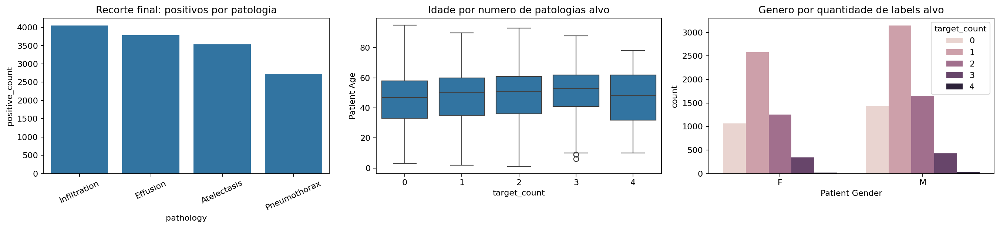
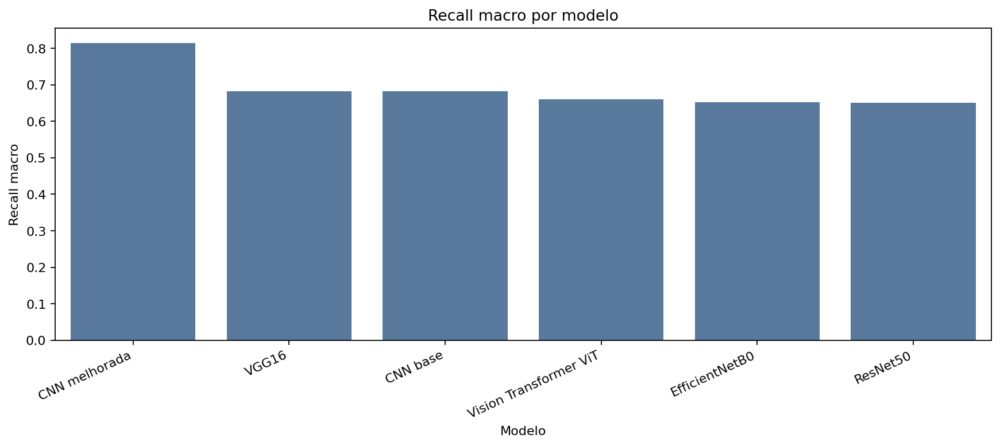
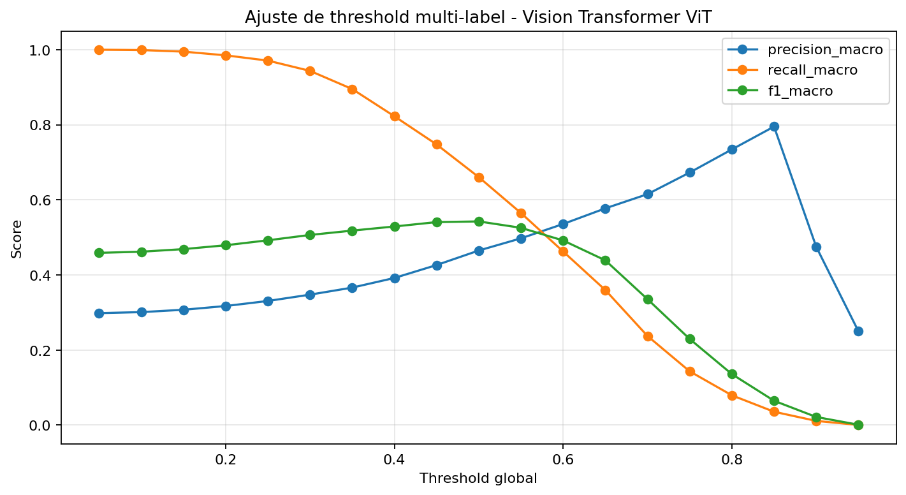

# CardioIA Vision - PBL Fase 4

Projeto academico de Visao Computacional para apoio a triagem de achados em radiografias de torax. A solucao usa o dataset publico NIH Chest X-rays, implementa modelos em PyTorch, compara CNNs e modelos pre-treinados, discute fairness e entrega um prototipo com backend Flask e app React Native/Expo.

> Aviso: este projeto tem finalidade academica e educacional. Ele nao deve ser usado como ferramenta diagnostica real.

## Entregas

| Item | Caminho |
|---|---|
| Notebook completo | `notebooks/CardioIA_Vision_PBL_Fase4.ipynb` |
| Relatorio tecnico curto | `Docs/relatorio_tecnico_fase4.md` |
| Relatorio do app mobile | `Docs/ir_alem_2_mobile.md` |
| Backend Flask | `backend/` |
| App React Native/Expo | `mobile-app/` |
| Docker Compose | `docker-compose.yml` |
| Artefatos de metricas/figuras | `notebooks/artifacts_cardioia_pytorch_multilabel/` |

## Problema

O desafio foi modelado como classificacao **multi-label** de quatro patologias no NIH Chest X-rays:

- `Infiltration`
- `Effusion`
- `Atelectasis`
- `Pneumothorax`

A escolha por multi-label e importante: uma mesma radiografia pode conter mais de um achado simultaneamente. Por isso, o modelo retorna quatro probabilidades independentes, uma para cada patologia, e nao apenas uma classe unica.

## Visao da solucao

```text
NIH Chest X-rays
        |
        v
EDA + validacao dos metadados
        |
        v
Pre-processamento das imagens
resize 224x224 + RGB + normalizacao ImageNet
        |
        v
Split por Patient ID
treino / validacao / teste
        |
        v
Treino e comparacao
CNN base, CNN melhorada, ResNet50, VGG16, EfficientNetB0, ViT
        |
        v
Metricas + fairness + escolha do modelo final
        |
        v
Backend Flask + App React Native/Expo + Docker
```

## Analise exploratoria

A EDA mostrou desbalanceamento relevante entre as patologias selecionadas e confirmou que o dataset possui casos multi-label.

| Patologia | Imagens | Percentual das linhas |
|---|---:|---:|
| Infiltration | 19.891 | 17,74% |
| Effusion | 13.316 | 11,88% |
| Atelectasis | 11.558 | 10,31% |
| Pneumothorax | 5.301 | 4,73% |




## Pre-processamento

O notebook implementa:

- leitura dos metadados do NIH Chest X-rays;
- vinculacao entre metadados e caminho das imagens;
- criacao das quatro colunas alvo;
- split por `Patient ID`, evitando vazamento de imagens do mesmo paciente;
- redimensionamento para `224x224`;
- conversao para RGB;
- normalizacao com media/desvio ImageNet;
- data augmentation no treino com flip horizontal e rotacao leve;
- `BCEWithLogitsLoss` com `pos_weight` para lidar com desbalanceamento.

## Modelos avaliados

Foram avaliados seis modelos:

| Grupo | Modelo | Objetivo |
|---|---|---|
| Baseline | CNN base | Cumprir o requisito de CNN treinada do zero |
| Incremental | CNN melhorada | Avaliar regularizacao/normalizacao e melhoria do baseline |
| Transfer learning | ResNet50 | Comparar arquitetura CNN profunda |
| Transfer learning | VGG16 | Comparar modelo classico trabalhado em aula |
| Transfer learning | EfficientNetB0 | Comparar modelo eficiente |
| Transformer | Vision Transformer ViT-B/16 | Comparar arquitetura baseada em atencao |

Todos os modelos foram implementados em PyTorch.

## Comparativo de resultados

O ranking final combinou:

- 40% F1 macro;
- 30% recall macro;
- 20% AUC-ROC macro;
- 10% tempo medio de inferencia.

| Modelo | F1 macro | Recall macro | AUC-ROC macro | PR-AUC macro | Tempo s/img | Score |
|---|---:|---:|---:|---:|---:|---:|
| Vision Transformer ViT | 0,5426 | 0,6605 | 0,7201 | 0,5323 | 0,0100 | 1,9 |
| VGG16 | 0,5392 | 0,6826 | 0,7157 | 0,5256 | 0,0100 | 2,0 |
| ResNet50 | 0,5277 | 0,6505 | 0,6998 | 0,4979 | 0,0102 | 4,0 |
| EfficientNetB0 | 0,5205 | 0,6516 | 0,6962 | 0,4896 | 0,0101 | 4,2 |
| CNN melhorada | 0,4821 | 0,8146 | 0,6483 | 0,4291 | 0,0102 | 4,4 |
| CNN base | 0,4935 | 0,6824 | 0,6667 | 0,4452 | 0,0110 | 4,5 |

O modelo final selecionado foi o **Vision Transformer ViT**. No teste, ele obteve:

- F1 macro: `0,5426`
- Recall macro: `0,6605`
- AUC-ROC macro: `0,7201`
- PR-AUC macro: `0,5323`
- Precision macro: `0,4651`
- Hamming loss: `0,3328`
- Acuracia exata multi-label: `0,2116`
- Tempo medio: `0,0100 s/imagem`

A acuracia exata e baixa porque, em multi-label, ela so conta acerto quando todas as quatro labels da imagem sao previstas corretamente ao mesmo tempo. Por isso, F1 macro, recall, AUC, PR-AUC, hamming loss e matrizes por patologia sao mais informativos.





## Matrizes de confusao

As matrizes abaixo mostram, para o modelo final, verdadeiros negativos, falsos positivos, falsos negativos e verdadeiros positivos por patologia. Essa leitura e mais adequada que uma unica matriz global, porque cada imagem pode ter multiplas labels.


Leitura geral:

- `Pneumothorax` e `Effusion` tiveram os melhores AUC-ROC individuais.
- `Infiltration` e `Atelectasis` foram mais dificeis, possivelmente por sinais visuais mais sutis ou maior sobreposicao com outros achados.
- A CNN melhorada apresentou recall alto, mas gerou muitos falsos positivos. Isso reforca que recall isolado nao basta em contexto de saude.

## Ajuste de threshold

O notebook tambem avalia o efeito de thresholds globais sobre F1, recall e AUC. Em um uso real, o ideal seria ajustar thresholds por patologia, pois o custo de falso negativo e falso positivo varia entre achados.



## Fairness e governanca

A etapa de fairness avaliou genero, faixa etaria e `View Position`. Foram calculadas metricas por subgrupo para qualquer patologia selecionada e tambem por patologia individual.

Pontos observados:

- ha diferencas relevantes por `View Position`;
- gaps por idade aparecem em algumas patologias;
- subgrupos pequenos devem ser interpretados com cautela;
- falsos negativos sao especialmente sensiveis em saude, pois podem atrasar investigacao clinica.


Mais detalhes:

- `notebooks/artifacts_cardioia_pytorch_multilabel/fairness_discussao.md`
- `notebooks/artifacts_cardioia_pytorch_multilabel/tabelas/fairness_gaps_por_subgrupo.csv`

## Backend Flask

O backend fica em `backend/app.py` e carrega o modelo final `Vision Transformer ViT`.

Endpoints:

| Metodo | Rota | Descricao |
|---|---|---|
| GET | `/health` | Verifica backend, device, labels e existencia do checkpoint |
| GET | `/metrics` | Retorna metricas do modelo final e metricas por classe |
| POST | `/predict` | Recebe imagem no campo multipart `image` e retorna probabilidades |

Fluxo do `/predict`:

1. recebe a imagem por multipart/form-data;
2. salva temporariamente;
3. converte para RGB;
4. redimensiona para `224x224`;
5. aplica normalizacao ImageNet;
6. executa o ViT;
7. aplica `sigmoid`;
8. retorna probabilidades e labels acima do threshold `0.5`.

Exemplo de teste:

```bash
curl http://localhost:5000/health
```

## Mobile app React Native/Expo

O app fica em `mobile-app/App.js`.

Funcionalidades:

- campo para configurar URL do backend;
- indicador de backend online/offline;
- selecao/upload de imagem;
- envio da imagem para `/predict`;
- exibicao das patologias detectadas;
- barras de probabilidade por classe;
- exibicao resumida das metricas do modelo final.

No Docker, o app sobe em modo web para facilitar a demonstracao no navegador. Fora do Docker, pode ser executado com Expo e aberto em Expo Go.

## Como executar com Docker

Pre-requisito: Docker Desktop aberto com engine Linux ativo.

Na raiz do projeto:

```bash
docker compose up --build
```

Servicos:

- Backend Flask: `http://localhost:5000`
- App web Expo: `http://localhost:8081`

Para rodar em segundo plano:

```bash
docker compose up -d --build
```

Para ver logs:

```bash
docker compose logs -f backend
docker compose logs -f mobile
```

Para parar:

```bash
docker compose down
```

O backend monta os artefatos do notebook como volume somente leitura:

```yaml
./notebooks/artifacts_cardioia_pytorch_multilabel:/app/notebooks/artifacts_cardioia_pytorch_multilabel:ro
```

Isso evita copiar checkpoints grandes para dentro da imagem Docker.

## Como executar sem Docker

Backend:

```bash
cd backend
python -m pip install -r requirements.txt
python app.py
```

Mobile/app:

```bash
cd mobile-app
npm install
npm run start:offline
```

Se o npm reclamar de permissao no cache do Windows:

```bash
npm install --no-audit --no-fund --progress=false --cache .\.npm-cache
```

## Checkpoints e GitHub

Os checkpoints `.pt` nao sao versionados porque alguns ultrapassam o limite de 100 MB do GitHub:

- `vision_transformer_vit.pt`
- `vgg16.pt`
- `resnet50.pt`
- outros checkpoints gerados durante o treinamento

Eles ficam ignorados por `.gitignore`:

```text
notebooks/artifacts_cardioia_pytorch_multilabel/modelos/*.pt
```

Para rodar o backend em outra maquina, existem tres opcoes:

1. executar o notebook e gerar novamente os checkpoints;
2. disponibilizar os `.pt` via Drive;
3. usar Git LFS, caso a entrega permita.

## Estrutura relevante

```text
.
├── Docs/
│   ├── enunciado_pbl.md
│   ├── ir_alem_2_mobile.md
│   └── relatorio_tecnico_fase4.md
├── backend/
│   ├── app.py
│   ├── Dockerfile
│   └── requirements.txt
├── mobile-app/
│   ├── App.js
│   ├── Dockerfile
│   ├── package.json
│   └── README.md
├── notebooks/
│   ├── CardioIA_Vision_PBL_Fase4.ipynb
│   └── artifacts_cardioia_pytorch_multilabel/
├── docker-compose.yml
└── README.md
```

## Relatorios complementares

- Relatorio tecnico curto: `Docs/relatorio_tecnico_fase4.md`
- Prototipo mobile e roteiro de video: `Docs/ir_alem_2_mobile.md`
- Justificativa do modelo final: `notebooks/artifacts_cardioia_pytorch_multilabel/justificativa_modelo_final.txt`
- Discussao de fairness: `notebooks/artifacts_cardioia_pytorch_multilabel/fairness_discussao.md`

## Limites de uso

O dataset NIH Chest X-rays possui labels derivados de laudos e pode conter ruido de anotacao. O modelo nao foi validado em ambiente clinico externo. Antes de qualquer uso real seriam necessarias revisao medica, validacao externa, calibracao de probabilidades, governanca de dados, monitoramento de vies e avaliacao de impacto.
